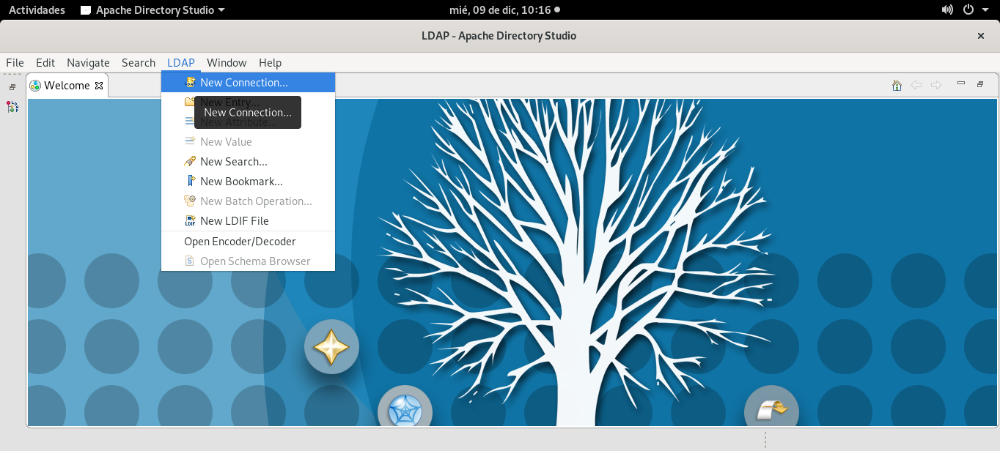
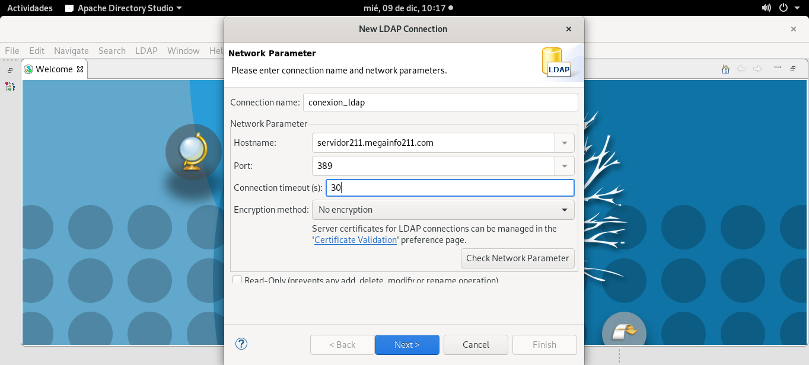
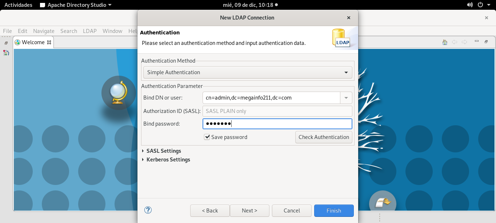
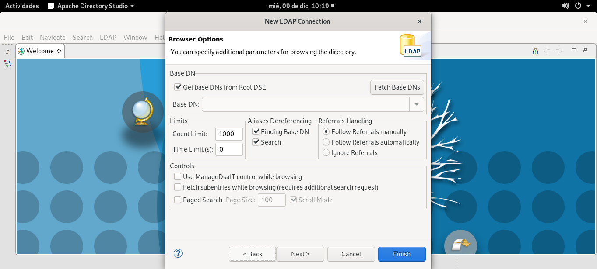
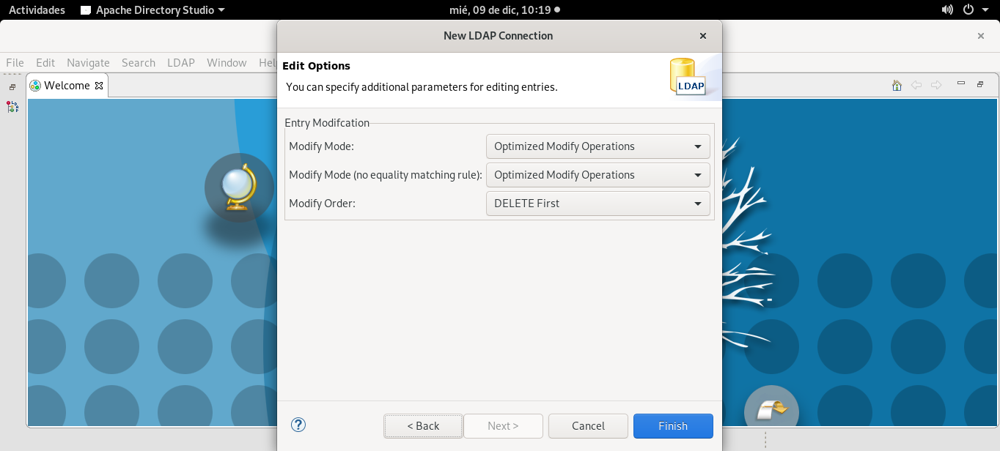

# Instalación Apache Directory Studio
[Link a Apache Directory Studio](https://directory.apache.org/studio/download/download-linux.html)
## Como Root
### Creamos Directorio de trabajo

``mkdir /home/fran/apacheDirectoryStudio``

``cd /home/fran/apacheDirectoryStudio``

### Descarga desde un mirror Oficial

``wget https://ftp.cixug.es/apache/directory/studio/2.0.0.v20200411-M15/ApacheDirectoryStudio-2.0.0.v20200411-M15-linux.gtk.x86_64.tar.gz``

### Descomprimimos

``tar -zvxf ApacheDirectoryStudio-2.0.0.v20200411-M15-linux.gtk.x86_64.tar.gz``

Cambiamos permisos y propitarios sobre el directorio de trabajo de Apache Directory Studio

``ls -l``

``chown -R fran:fran /home/fran/apacheDirectoryStudio/``

### Instalamos la OpenJDK (Es necesario para su uso)

``apt install default-jdk``

## Sin privilegios de root

### Comprobamos que tengamos privilegios necesarios

``cd ~/apacheDirectoryStudio/``

``ls -l``

### Ejecutamos Apache Directory Studio

``./ApacheDirectoryStudio``

**Listo**

## Configuración Apache Directory Studio (Gráfico)

### Creamos la conexión con servidor LDAP

*[Algunas capturas varias de como crear entradas...](../../imagenes/capturas)*
_________________________________________________
*[Volver al indice...](../../README.md)*