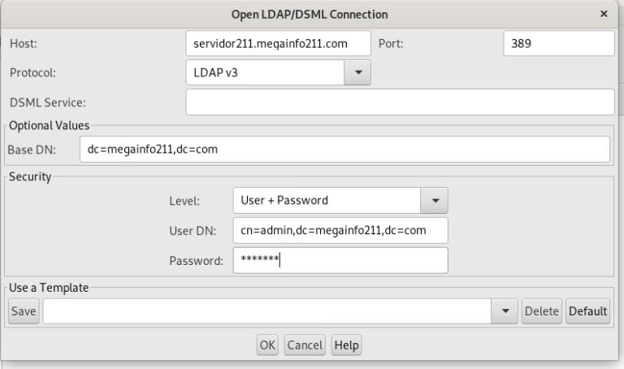
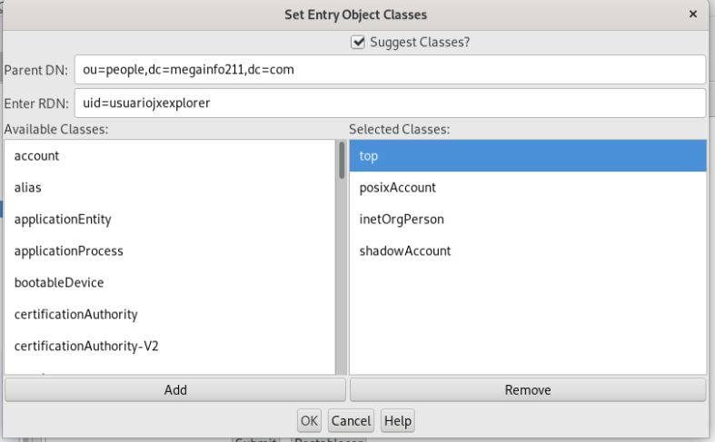
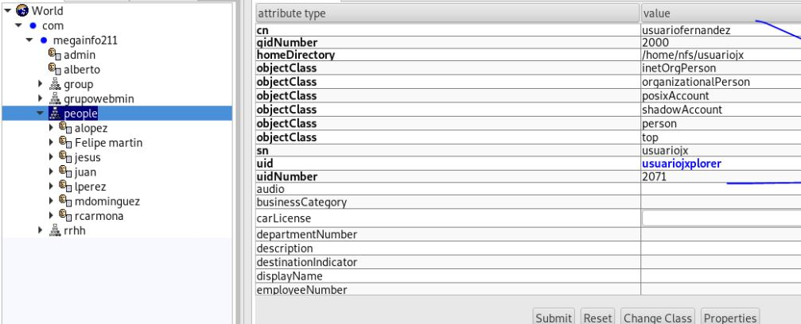
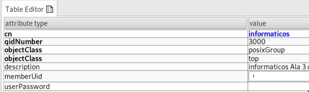
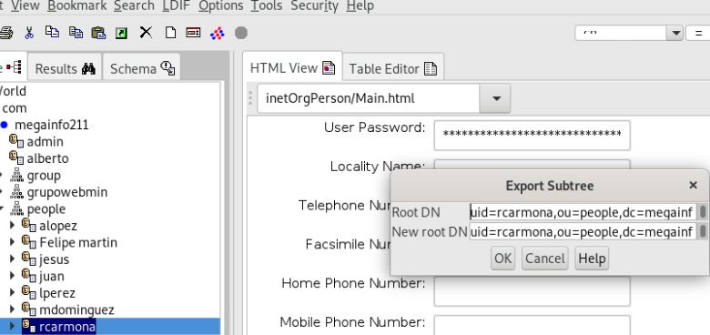

# Instalación phpLDAPadmin
[Link a Web oficial de Jxplorer](http://jxplorer.org)
## Como Root

### Instalamos MariaDB, Apache y PHP

``apt update``

**apt upgrade**

``apt install default-jdk``

``apt install default-jre``

**¡Ojo! También podemos intalar una versión específica...**

**apt install openjdk-11-jdk**
**apt install openjdk-11-jre**

``apt install jxplorer -y``

## Ejecutar jxplorer

No se puede ejecutar como root (Debian 10)

*Otros errores posibles documento Moodle o THOSHIBA*

### Conexión a OpenLDAP (Gráfico)

### Crear un usuario (Gráfico)

### Crear grupo

### ExportarUsuario

*Otras posibles actulizaciones o entradas documento Moodle*
_________________________________________________
*[Volver atrás...](../README.md)*

*[Volver al indice pincipal...](../../README.md)*