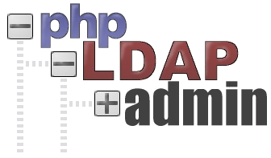
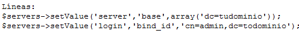
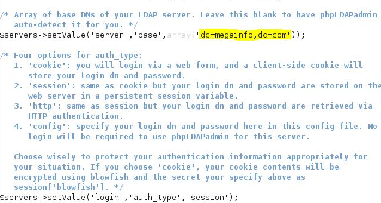
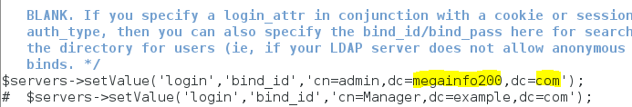

# Instalación phpLDAPadmin
[Link de debian.org para el .deb de phpLDAPadmin](https://packages.debian.org/sid/all/phpldapadmin/download)
## Como Root

### Instalamos MariaDB, Apache y PHP

``apt update``

**apt upgrade**

``apt install mariadb-server mariadb-common mariadb-client -y``

``apt install apache2 -y``

``apt install php7.3 -y``

**Instalamos algunos paquetes necesarios de php para phpLDAPadmin**

``apt install php-xml php7.3-ldap -y``

### Descarga desde un mirror Oficial

``wget http://ftp.es.debian.org/debian/pool/main/p/phpldapadmin/phpldapadmin_1.2.2-6.3_all.deb``

### Instalamos el .deb

**apt install gdebi**
  
``gdebi phpldapadmin_1.2.2-6.3_all.deb``

### Reiniciamos los servicios

``systemctl restart mariadb.service ``

``systemctl restart apache2.service ``

**Listo**

## Errores de acceso a LDAP  desde web

``firefox localhost/phpldapadmin``

### Editar las siguientes líneas:

**Línea 300**

**Línea 326**

*Otros errores posibles documento Moodle*

## Crear entradas (Gráfico)

### Usuarios

*Crear nuevo objeto > Generico: Cuenta de usuario*

A la hora de crear el usuario tendremos que elegir como loginShell "/bin/sh" tendremos que modificarlo

*Selleccionamos usuario > Cambiar Plantilla > loginShell*

*Otras posibles actulizaciones o entradas documento Moodle*
_________________________________________________
*[Volver atrás...](../README.md)*        *[Volver al indice pincipal...](../../README.md)*